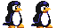
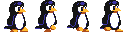

# Super Tux Wars
A fan-inspired arena platformer built with Godot 4. Started for fun; anyone can contribute. This project will remain open source under the MIT license.

---


*The current development status screenshot*

- *Tux*: Player character
- *FreeBSD Beastie*: NPC
- *Level*: Ugly test level

*Controls*
- Move: A/D or Left/Right
- Jump: Space or W

---

### Goals (may change)
- **Multiplayer**: Local first; P2P networking later; dedicated servers maybe after that
- **Worlds & levels**: Multiple worlds with levels you can play solo vs NPCs or versus other players
- **Characters**: Open-source–inspired, non-infringing mascots (e.g., tux, beastie, fish, gnu, etc.)
- **Items**:
  - Breakable stompboxes that spawn items
  - Fish (power-up), floppies (collectible), sudo (invincibility)
  - Throwable hazards; level-wide stun item
- **Game modes (later focus)**: deathmatch, team deathmatch, capture the flag, last one standing, collect the floppies

We will first focus on core gameplay foundations: characters, items, levels, and multiplayer. Game modes come later.

### Roadmap
- **Short term**: refine movement/jumping; add jump/fall animations; basic items; level builder with tilesets and tilemaps; local multiplayer.
- **Mid term**: P2P networking; more characters and items; network polish; exports for Linux/Windows.
- **Long term**: dedicated servers; game modes; maybe macOS/mobile.

### Running the game
- Godot version: 4.5.1-stable
- Open in editor:
  ```bash
  godot4 --editor --path .
  ```
- Run:
  ```bash
  godot4 --path .
  ```
- Main scene: `scenes/levels/test_level.tscn`

### Art & assets
- Base character pixel art is in `assets/characters/<slug>/base-16x16.ase`
- Pipeline: design at 16x16, upscale to 128x128 for character spritesheets (crisp pixel-art look).
- Current animations:
  - Idle: 2 frames at 4 FPS
  - Run: 4 frames at 8 FPS
  - Planned: Jump (4), Fall (4), Death (2)
- Frame order: left-to-right across the spritesheet.
- Showcase images:
  - 
  - 
- Godot import settings (per texture in the Import dock):
  - Filter: Off
  - Mipmaps: Off
  - Repeat: Disabled
  - Project Settings (recommended for pixel art): 2D → Use Pixel Snap = On
- Naming convention (proposed standardization):
  - `assets/characters/<slug>/base-16x16.png` (base)
  - `assets/characters/<slug>/spritesheets/idle.png` (sheet)
  - `assets/characters/<slug>/spritesheets/run.png` (sheet)
  - Use lowercase slugs

### Contributing
- Workflow: fork → feature branch → PR; discuss larger changes in issues first.
- Language/style: GDScript; keep changes focused and PRs small where possible.
- Assets: submit original or properly licensed assets; include required attributions; follow the sizes and naming above.
- License: MIT (code and assets). By contributing, you agree to license your contributions under MIT.
- Local testing: run with Godot 4.5.1 (see above).


### Acknowledgements
- Inspired by community-made arena platformers like Super Mario Wars.
- Thanks to all open-source contributors and tool authors (Godot, LibreSprite, etc.).

### Legal
- We do not use actual third‑party logos. Characters and items are original, non‑confusing stylizations to avoid trademark infringement and usage restrictions.
- No Nintendo IP.
- Attributions are included in-source and/or in-game where required (e.g., if any artwork derives from assets that require attribution). If you contribute assets needing attribution, include the attribution text in your PR.
- By contributing, you agree your code and assets are licensed under MIT for this project.
